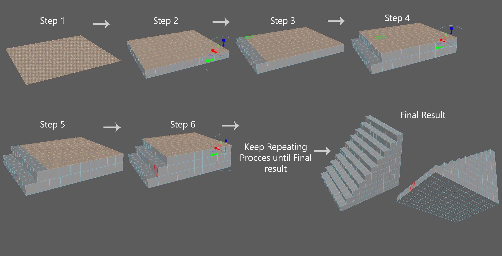

# Stone-Stair-Maker

A stair maker tool for Maya.

Generate a stair with any given parameters. 

Install instructions are on python file. 

By Chase Miller

# How it's generated.
 - NOTE - Maya uses centimeters for units of measurement.
 - Step 1 - A pollyplane grid is created based on the user's selected width and length. 
 - Step 2 - The pollyplane is extruded by users selected height.
 - Step 3 - Top surface selection is decreased by in increment of 1.
 - Step 4 - Top surface selection is again extruded.
 - Step 5 - Step 3 is repeated.
 - Step 6 - Step 4 is repeated.
 - Last two steps are repeated in a loop until the final result is achieved.

