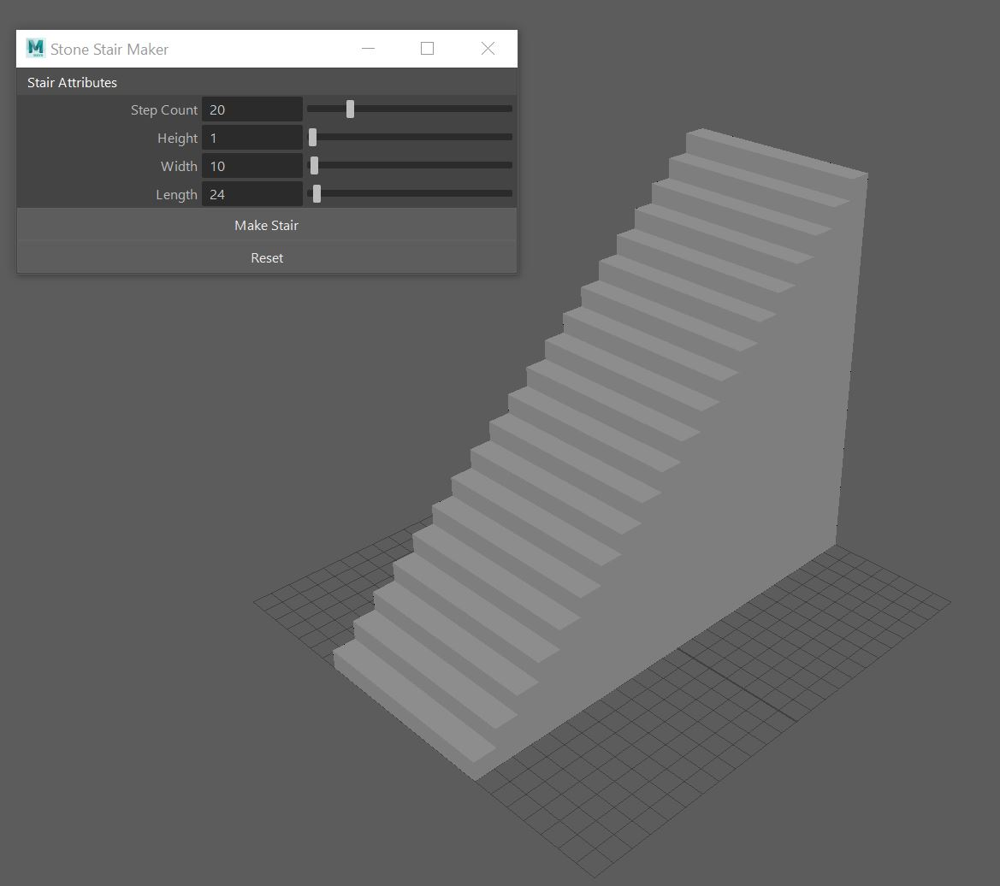

# Stone-Stair-Maker
A stair maker tool for Maya
By Chase Miller

Install Instructions: 
1. *Windows- Place script file in: C:\Users\NAME\Documents\maya\2019\scripts
2. copy paste into python console -
    import stairMaker
    reload(stairMaker)
    stairMaker.StairUI().show()

3. Highlight, then middle mouse drag code to maya shelf.

